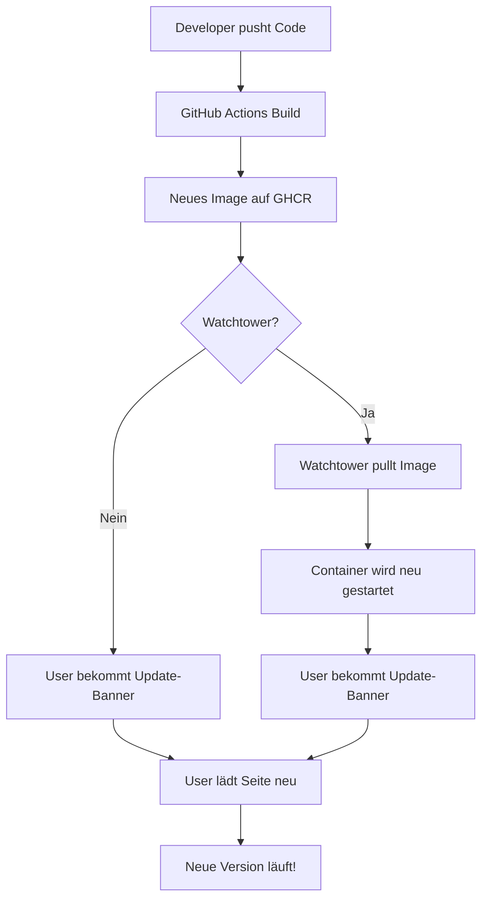

# 🔄 Auto-Update System für SubCaster

SubCaster bietet ein intelligentes Update-System mit mehreren Ebenen:

## 📦 Architektur

### 1. Version Tracking
- **Build-Time:** Git Commit SHA wird beim Docker-Build ins Image gebacken
- **Runtime:** Version ist über `/api/version` endpoint verfügbar
- **Frontend:** Prüft regelmäßig auf neue Versionen

### 2. Update Detection
- **Check-Interval:** Alle 60 Sekunden (1 Minute)
- **Methode:** Frontend fragt `/api/version` ab
- **Vergleich:** Git Commit SHA wird verglichen

### 3. User Notification
- **Banner:** Schönes Gradient-Banner erscheint am oberen Bildschirmrand
- **Optionen:**
  - ✅ "Jetzt neu laden" → Sofortiges Page Reload
  - ⏭️ "Später" → Banner wird ausgeblendet, erscheint nach 5 Minuten wieder
- **Auto-Dismiss:** Banner wird nach 30 Sekunden transparent

## 🚀 Deployment-Optionen

### Option A: Nur Frontend-Notification (Standard)
User bekommt Update-Banner und kann manuell neu laden.

```bash
# Standard docker-compose
docker-compose -f docker-compose.env.yml up -d
```

**Vorteil:** User behält Kontrolle  
**Nachteil:** Manuelles Pullen des Images nötig

---

### Option B: Mit Watchtower (Automatisch)
Container updated sich automatisch und User bekommt Notification.

```bash
# Mit Auto-Update
docker-compose -f docker-compose.autoupdate.yml up -d
```

**Vorteil:** Komplett automatisch  
**Nachteil:** Container-Restarts können laufende Sessions unterbrechen

## ⚙️ Watchtower Konfiguration

### Standard-Einstellungen:
- **Check-Interval:** Alle 5 Minuten
- **Cleanup:** Alte Images werden gelöscht
- **Label-basiert:** Nur Container mit `com.centurylinklabs.watchtower.enable=true`

### Anpassen:
```yaml
environment:
  # Intervall in Sekunden (300 = 5 Minuten)
  - WATCHTOWER_POLL_INTERVAL=300
  
  # Nur zu bestimmten Zeiten updaten (Cron-Format)
  # - WATCHTOWER_SCHEDULE=0 0 4 * * *  # Jeden Tag um 4 Uhr
  
  # Discord Notifications
  # - WATCHTOWER_NOTIFICATION_URL=discord://webhook_id/webhook_token
```

## 🔐 GitHub Container Registry Access

Für private Repositories muss Watchtower Zugriff auf GHCR haben:

```bash
# GitHub Personal Access Token erstellen mit 'read:packages'
# https://github.com/settings/tokens

# Docker Login
echo "YOUR_GITHUB_TOKEN" | docker login ghcr.io -u YOUR_USERNAME --password-stdin

# Watchtower verwendet automatisch ~/.docker/config.json
```

## 📊 Workflow



## 🧪 Testing

### 1. Version anzeigen:
```bash
# Im laufenden Container
docker exec subcaster env | grep -E "(APP_VERSION|GIT_COMMIT|BUILD_DATE)"
```

### 2. Update simulieren:
```bash
# Code ändern und pushen
git add .
git commit -m "Test update"
git push

# Warten bis Build fertig (~3-5 Min)
# Frontend-Banner sollte nach 1-2 Minuten erscheinen
```

### 3. Watchtower Logs:
```bash
docker logs -f subcaster-watchtower
```

## 🎯 Best Practices

### Für Entwickler:
- ✅ Semantic Versioning in Git Tags verwenden
- ✅ Changelog führen für User
- ✅ Breaking Changes klar kommunizieren

### Für Deployment:
- ✅ Health Checks aktivieren (Container-Restart safe)
- ✅ Watchtower außerhalb der Hauptzeiten laufen lassen
- ✅ Backup-Strategie für persistente Daten

### Für User:
- ✅ Banner nicht ignorieren (Security-Updates!)
- ✅ Laufende Streams vor Update beenden
- ✅ Browser-Cache bei Problemen löschen

## 🔧 Troubleshooting

### "Update-Banner erscheint nicht"
```bash
# Prüfe ob Version-Endpoint funktioniert
curl http://localhost:3002/api/version

# Prüfe Browser Console (F12)
# Sollte sehen: "🔄 Starting update checker service..."
```

### "Watchtower updated nicht"
```bash
# Prüfe Watchtower Logs
docker logs subcaster-watchtower

# Manuelles Update forcieren
docker exec subcaster-watchtower watchtower --run-once
```

### "Container startet nach Update nicht"
```bash
# Prüfe Logs
docker logs subcaster

# Zurück zur vorherigen Version
docker-compose down
docker pull ghcr.io/lokke/subcaster:main-PREVIOUS_SHA
docker-compose up -d
```

## 📝 Changelog Location

Updates werden dokumentiert in:
- **GitHub Releases:** https://github.com/Lokke/subcaster/releases
- **Git Commits:** https://github.com/Lokke/subcaster/commits/main
- **Docker Labels:** `docker inspect ghcr.io/lokke/subcaster:latest`

## 🎉 Fertig!

Deine SubCaster-Instanz ist jetzt Update-bereit! 🚀

Bei jedem `git push`:
1. ✅ Neues Image wird gebaut
2. ✅ Watchtower erkennt das Update (wenn aktiviert)
3. ✅ Container wird neu gestartet
4. ✅ User bekommt schönes Update-Banner
5. ✅ User lädt Seite neu → Neue Version! 🎊
